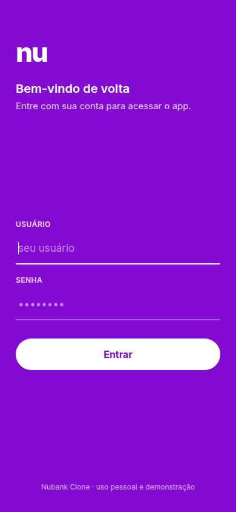
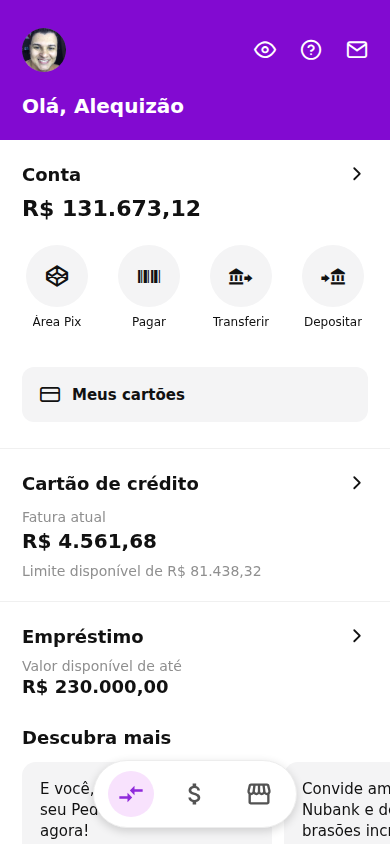
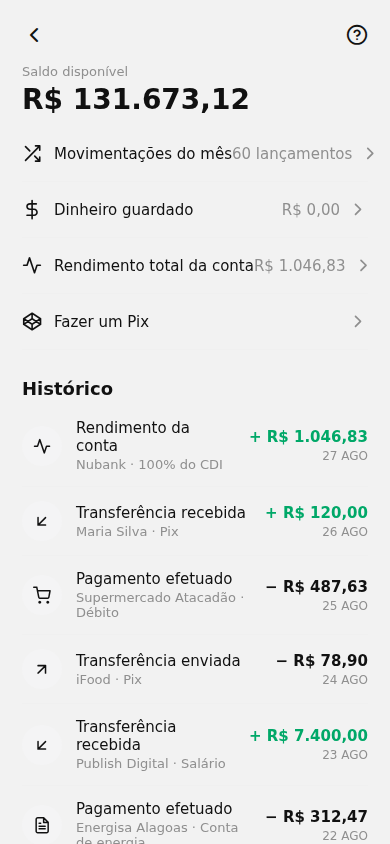
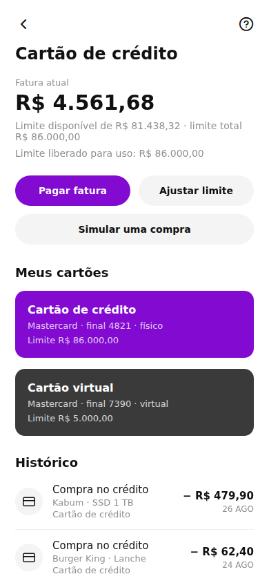
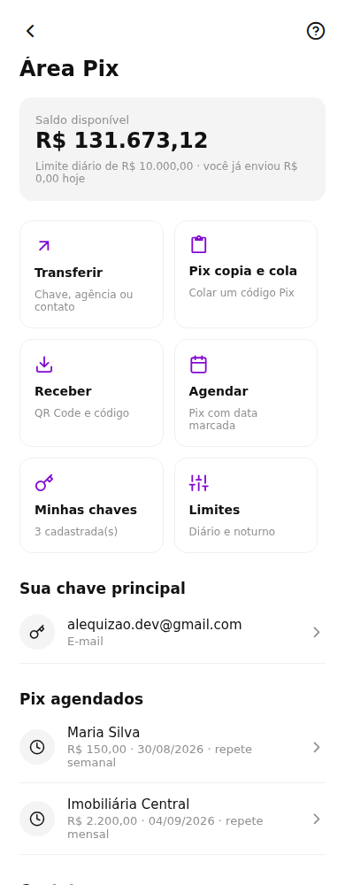
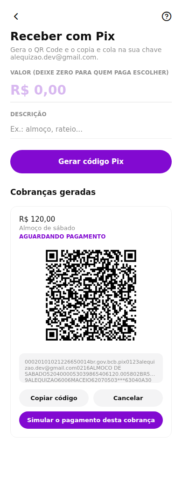
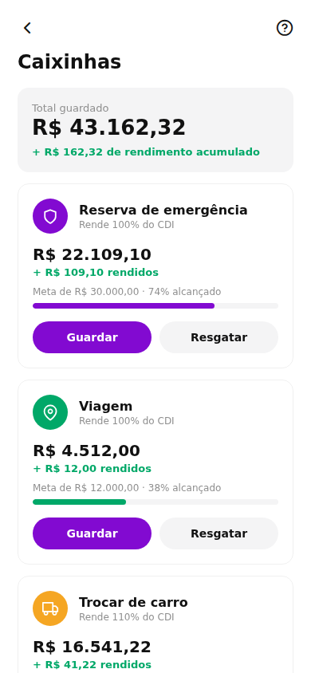
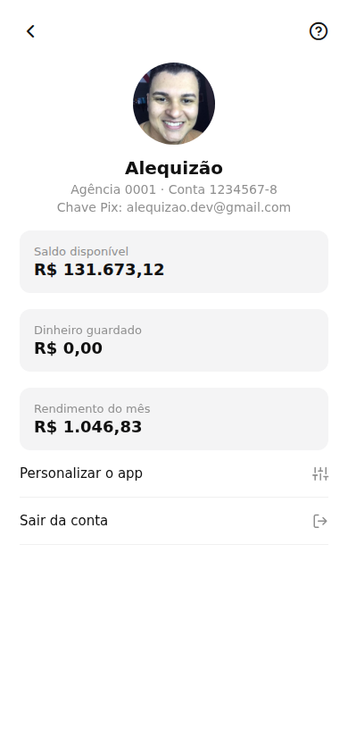

# nubank-clone

Clone do aplicativo Nubank em React Native + Expo, publicado como **PWA em tela cheia**
com backend PHP + MySQL: login, painel de personalização e todas as operações do banco
simuladas de verdade (saldo, fatura e extrato mudam a cada operação).

## 📸 Telas do sistema

| Login | Início |
|:---:|:---:|
|  |  |

<details>
<summary>Ver as demais telas</summary>

| Conta e extrato | Cartão de crédito |
|:---:|:---:|
|  |  |

| Área Pix | Receber com QR Code |
|:---:|:---:|
|  |  |

| Caixinhas com rendimento | Perfil |
|:---:|:---:|
|  |  |

</details>

## 🚀 Instalação nesta hospedagem

**URLs**

- https://nubank.alequizao.com — PWA instalável (recomendado)
- https://publishdev.com.br/nubank/ — mesmo app no subcaminho
- `admin.php` — painel de personalização
- `?tela=conta` · `?tela=cartao` · `?tela=limite` · `?tela=perfil` — abre direto numa tela

**Acesso master:** `alequizao` / `alequizao`

### Como funciona

O repositório original é um app Expo/React Native só de interface. Aqui ele virou um app
web (PWA) servido por PHP: o `index.php` exige login e entrega o build do Expo, e o app
busca todos os dados em `api.php` — nada é chumbado no código.

**Tudo é configurável pelo painel (`admin.php`)**: nome, foto, CPF, agência/conta, chave Pix,
saldo, dinheiro guardado, rendimento, limite total, fatura, limite liberado, empréstimo
disponível e contratado, cartões, contatos e o extrato inteiro.

O app abre em **tela cheia** (`display: fullscreen`, respeitando o recorte do topo) e
atualiza os dados ao **puxar a tela para baixo**.

**Área Pix completa:** transferir por chave ou contato, **Pix copia e cola** (lê o BR Code
colado, com nome e valor), **receber com QR Code** e copia e cola gerados no padrão EMV do
Banco Central (com CRC16), cobranças com status, **Pix agendado** (uma vez, semanal ou
mensal — executa sozinho na data, e falha com motivo se faltar saldo), **minhas chaves**
(CPF, e-mail, celular e aleatória, até 5, com principal) e **limites** diário e noturno
(20h–6h) que barram o envio quando estouram.

**Caixinhas com rendimento:** cada caixinha guarda um valor separado do saldo, tem meta,
ícone e cor próprios e **rende sozinha todo dia** pelo percentual do CDI configurado
(taxa equivalente diária, creditada de forma idempotente na primeira abertura do dia).
O "dinheiro guardado" do perfil é sempre a soma das caixinhas.

**Operações simuladas** (mudam saldo, fatura e extrato de verdade, tanto no app quanto no painel):
Pix enviar/receber, transferir, pagar boleto, depositar, recarga, cobrar, guardar e resgatar
na caixinha, compra no crédito, pagar fatura, ajustar limite e contratar empréstimo.

### Banco de dados MySQL

Banco, usuário e senha `nubank` (em `backend/config.php`).

| Tabela | Função |
| --- | --- |
| `usuarios` | contas de acesso (níveis `master`, `admin`, `cliente`) |
| `acessos` | log de tentativas de login (IP, user-agent) |
| `perfil` | titular, saldos, limites e empréstimo — o que o app exibe |
| `cartoes` | cartões físicos e virtuais |
| `contatos` | destinatários rápidos do Pix/transferência |
| `caixinhas` | caixinhas: meta, saldo, % do CDI e rendimento acumulado |
| `pix_chaves` / `pix_agendados` / `pix_cobrancas` | chaves, agendamentos e cobranças da área Pix |
| `transacoes` | extrato — `origem` = `conta`, `credito` ou `caixinha` |

### Arquivos

| Caminho | Função |
| --- | --- |
| `index.php` | exige login e serve o app (a URL `/index.php` redireciona para `/`) |
| `login.php` / `logout.php` | tela de login e saída |
| `api.php` | API JSON do app: `?acao=estado` e as operações via POST |
| `admin.php` | painel de personalização e simulação |
| `manifest.php` / `service-worker.js` | PWA em tela cheia (nome, ícones, escopo, cache) |
| `pull-refresh.js` | puxar para atualizar (dispara `nubank:atualizar` no app) |
| `backend/config.php` | credenciais do banco e do usuário master |
| `backend/db.php` / `backend/auth.php` | conexão PDO e sessão |
| `backend/dados.php` | leitura do estado e todas as operações simuladas |
| `backend/pix.php` | chaves, BR Code (gerar/ler), cobranças, agendamentos e limites |
| `qr.php` | PNG do QR Code de uma cobrança (chillerlan/php-qrcode, com cache) |
| `backend/schema.sql` / `backend/instalar.php` | schema e instalador |
| `backend/tools/gerar_icones.py` | gera ícones e splash do PWA |
| `src/servicos/api.ts` | cliente da API dentro do app |
| `src/estado/AppContexto.tsx` | estado global do app (dados + operações) |
| `src/pages/Operacao` | tela genérica que executa qualquer operação |
| `web-build/` | build web do Expo (gerado) |

### Comandos

```bash
cd /www/wwwroot/publishdev.com.br/nubank
yarn install                            # dependências do app
composer install                        # gerador de QR Code (vendor/)
npx expo export:web                     # gera web-build/
php backend/instalar.php                # tabelas + master + dados iniciais
python3 backend/tools/gerar_icones.py   # regera os ícones do PWA
chown -R www:www .
```

Vhost Apache: `/www/server/panel/vhost/apache/nubank.alequizao.com.conf` (PHP 8.3).
Após editá-lo: `/www/server/apache/bin/apachectl -k graceful`.

---

## 👨‍💻 Desenvolvedor

Fork mantido e evoluído por **Alequizao** — Analista e Desenvolvedor de Sistemas em
Maceió, Alagoas. Os créditos do projeto original permanecem com seus autores; aqui ficam
as modificações, o backend e a versão em produção.

- **E-mail:** alequizao.dev@gmail.com
- **GitHub:** [@alequizao](https://github.com/alequizao)

Quer um sistema como este para o seu negócio? Entre em contato.

---

Projeto de estudo e demonstração. "Nubank" é marca registrada do Nu Pagamentos S.A.;
este repositório não tem qualquer vínculo com a empresa.
